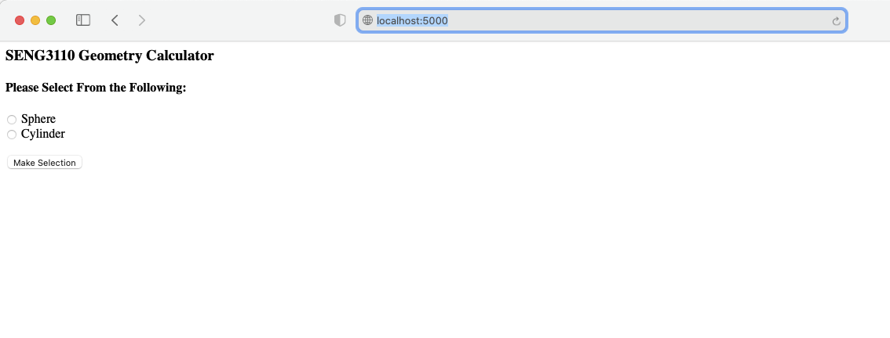

# Geometry Calculator Web

This is starter code for the web version of the Geometry Calculator used in SENG3120 & SENG3110

Use this as sample code for lab activities when requested.

---

## App Prep & Run Steps

*To use this code do the following:*

1. **Pick a location on disk and clone this code into a local repository:**

    `git clone https://github.com/axbjos/geometry_calculator_web.git`

    (Alternatively the new GitHub CLI could also be used)

    A new directory will be created:  geometry_calculator_web   "cd" into it.

2. **Create a Python Virtual Environment**

    This is a Flask-based Python Web App. It is necessary to use the pip installer to install several different packages as can be found in "requirements.txt"
    
    It is advisable to use a Python Virtual Environment to keep Calculator App's dependencies separate from other Python dependencies on the target machine. To learn more about why Python environments are often used and how visit: https://docs.python.org/3/tutorial/venv.html
    
    Again, make sure you are in the geometry_calculator_web direction created by the git clone.  Then do the following: 

    Unix OS's:   
    `python3 -m venv .`

    Windows:
    
    `python -m venv .`

    On Unix system a new directory should be created named "bin."  On Windows it will be named "Scripts."   Use the "activate" script to activate the Python virtual environment.
    
3. **Activate the PythonVirtual Environment:**

    Unix OS's (use the unix "source" command to run the script):  
    `source bin/activate`

    Windows:
    `Scripts\activate.bat`

4. **Install App Dependencies Using the Python Package Tool:**

    Rather than using pip to install all the required dependencies manually one-by-one, all dependencies are listed in the requirements.txt file.  Have pip automatically install them.

    `pip install -r requirements.txt`

    In a virtual environment that was created using Python 3 on Unix OS's there no need to use the command pip3.  You can, but pip also works in this instance.

5. Run the Application:

    `python GeometryCalcWeb.py`

    The App should now be running.  Access it via `localhost:5000`

    Running App:

    

## Python Unit Testing

This repo also contains two sample Unit Tests.  One for the cylinder.py module.  One for the GeometryCalcWeb.py program.  It is up to the student to understand how the Unit Tests work. Reference course resources, notes taken in class, instructor demo's.

Run them by doing the following:

> python cylinderTest.py

> python GeometryCalcWeb.py
